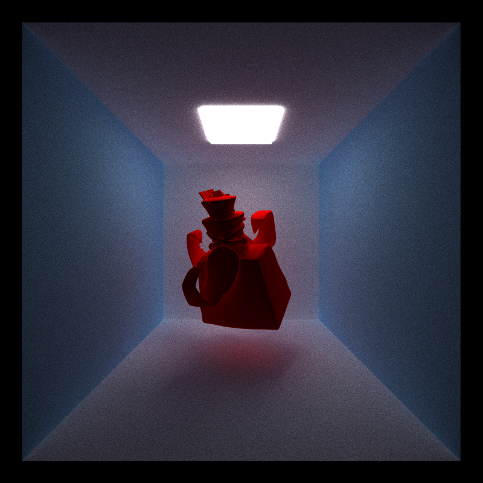
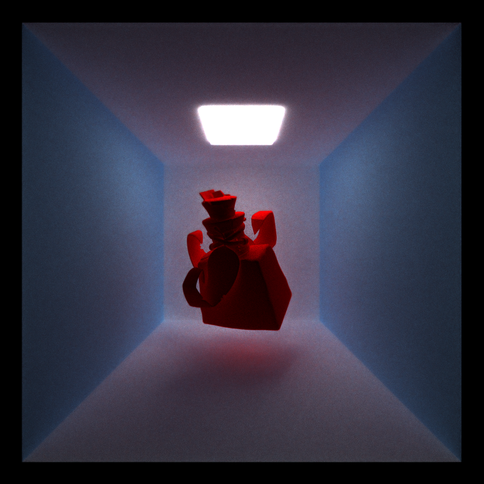

CUDA Path Tracer - using 2 late days
================

**University of Pennsylvania, CIS 565: GPU Programming and Architecture, Project 3**

* Caroline Fernandes
  * [LinkedIn](https://www.linkedin.com/in/caroline-fernandes-0-/), [personal website](https://0cfernandes00.wixsite.com/visualfx)
* Tested on: Windows 11, i9-14900HX @ 2.20GHz, Nvidia GeForce RTX 4070

### Features and Sections

The goal of this project was to implement a CUDA-based path tracer. The base code was provided which implemented the openGL interop, previewing and saving images, as well as loading a scene description file.

Core Features:
- [Shading](https://github.com/0cfernandes00/Project3-CUDA-Path-Trace/blob/main/README.md#shading)
- [Stream Compaction](https://github.com/0cfernandes00/Project3-CUDA-Path-Trace/blob/main/README.md#stream-compaction)
- [Material Sorting](https://github.com/0cfernandes00/Project3-CUDA-Path-Trace/blob/main/README.md#material-sorting)
- [Anti-Aliasing](https://github.com/0cfernandes00/Project3-CUDA-Path-Trace/blob/main/README.md#anti-aliasing)

Part 2 Features:
- [Russian Roulette Termination](https://github.com/0cfernandes00/Project3-CUDA-Path-Trace/blob/main/README.md#russian-roulette-termination)
- [Depth of Field](https://github.com/0cfernandes00/Project3-CUDA-Path-Trace/blob/main/README.md#depth-of-field)
- [Refraction](https://github.com/0cfernandes00/Project3-CUDA-Path-Trace/blob/main/README.md#refraction)
- [Texture Mapping](https://github.com/0cfernandes00/Project3-CUDA-Path-Trace/blob/main/README.md#texture-mapping)
- [Mesh Loading](https://github.com/0cfernandes00/Project3-CUDA-Path-Trace/blob/main/README.md#mesh-loading)
- [Bounding Volume Hierarchies](https://github.com/0cfernandes00/Project3-CUDA-Path-Trace/blob/main/README.md#bouding-volume-hierarchies)
- [Intel Image Denoise](https://github.com/0cfernandes00/Project3-CUDA-Path-Trace/blob/main/README.md#intel-image-denoise)

### Shading
I implemented ideal diffuse and specular shading. Dffuse shading distributes light uniformly and specular materials distribute light in one direction.

### Stream Compaction
Using thrust's library I was able to stream compact away paths that had terminated organizing the paths better in memory.

### Material Sorting
I had originally expected material sorting to improve performance but it doesn't seem to have a huge speedup. This could potentially be because the way it's sorting the materials is too expensive of an operation to outweigh the benefits of putting similar materials close together in memory. 

### Anti-Aliasing
I implemented Stochastic sampled antialiasing by jittering the ray that was generated from the camera with a small offset in both the x & y directions.

 

### Russian Roulette Termination
Russian Roulette Termination is a way of randomly terminating paths early that seem to have low throughput contributions

### Depth of Field

 

### Refraction

### Texture Mapping
This was one of the last features I implemented and spent a good amount of time debugging uvs and textures.

Environment Mapping

### Mesh Loading
I implemented OBJ loading using the tinyOBJ library.

### Bounding Volume Hierarchies
I implemented BVH and used AABB for the bounds test.

### Intel Image Denoise
I integrated [Intel's Denoiser](https://github.com/RenderKit/oidn) which utilizes Deep Learning methods to converge the results faster. This feature provided a much nicer image but it effectively blurred hard edges in geometry. I'd be interested to test out the optimal number of denoise iterations get rid of the noise and still preserve hard edges.

 

### Bloopers

