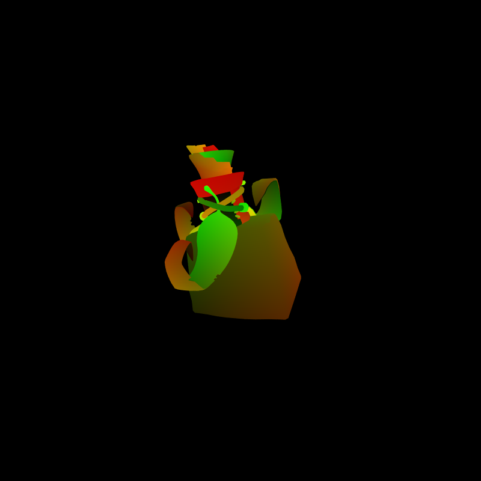

CUDA Path Tracer - using 2 late days
================

**University of Pennsylvania, CIS 565: GPU Programming and Architecture, Project 3**

* Caroline Fernandes
  * [LinkedIn](https://www.linkedin.com/in/caroline-fernandes-0-/), [personal website](https://0cfernandes00.wixsite.com/visualfx)
* Tested on: Windows 11, i9-14900HX @ 2.20GHz, Nvidia GeForce RTX 4070

I modified CMakeLists.txt to integrate OIDN Libraries for Denoising and the tinyOBJ library for Mesh loading.

### Features and Sections

The goal of this project was to implement a CUDA-based path tracer. The base code provided to me had implemented the openGL interop, previewing and saving images, as well as loading a scene description file.

Core Features:
- [Shading](https://github.com/0cfernandes00/Project3-CUDA-Path-Tracer/blob/main/README.md#shading)
- [Stream Compaction](https://github.com/0cfernandes00/Project3-CUDA-Path-Tracer/blob/main/README.md#stream-compaction)
- [Material Sorting](https://github.com/0cfernandes00/Project3-CUDA-Path-Tracer/blob/main/README.md#material-sorting)
- [Anti-Aliasing](https://github.com/0cfernandes00/Project3-CUDA-Path-Tracer/blob/main/README.md#anti-aliasing)

Part 2 Features:
- [Russian Roulette Termination](https://github.com/0cfernandes00/Project3-CUDA-Path-Tracer/blob/main/README.md#russian-roulette-termination)
- [Depth of Field](https://github.com/0cfernandes00/Project3-CUDA-Path-Trace/blob/main/README.md#depth-of-field)
- [Refraction](https://github.com/0cfernandes00/Project3-CUDA-Path-Tracer/blob/main/README.md#refraction)
- [Texture Mapping](https://github.com/0cfernandes00/Project3-CUDA-Path-Tracer/blob/main/README.md#texture-mapping)
- [Mesh Loading](https://github.com/0cfernandes00/Project3-CUDA-Path-Tracer/blob/main/README.md#mesh-loading)
- [Bounding Volume Hierarchies](https://github.com/0cfernandes00/Project3-CUDA-Path-Tracer/blob/main/README.md#bounding-volume-hierarchies)
- [Intel Image Denoise](https://github.com/0cfernandes00/Project3-CUDA-Path-Tracer/blob/main/README.md#intel-image-denoise)

### Shading
I implemented ideal diffuse and specular shading. Diffuse shading distributes light uniformly and specular materials distribute light in one direction.

### Stream Compaction
TODO: Performance Impact Analysis for open/closed scenes, Print and plot the effects of stream compaction within a single iteration (i.e. the number of unterminated rays after each bounce) and evaluate the benefits you get from stream compaction.

Using thrust's library I was able to stream compact away paths that had terminated organizing the paths better in memory.

### Material Sorting
TODO: Performance Impact Analysis

I had originally expected material sorting to improve performance but it doesn't seem to have a huge speedup. This could potentially be because the way it's sorting the materials is too expensive of an operation to outweigh the benefits of putting similar materials close together in memory. 

### Anti-Aliasing
I implemented Stochastic Sampled Antialiasing by jittering the ray that was generated from the camera with a small offset in both the x & y directions.

 

### Russian Roulette Termination
TODO: before after photos,Performance Impact

Russian Roulette Termination is a way of randomly terminating paths early that seem to have low throughput contributions. This feature is meant to optimize out unhelpful or unuseful paths. For open scenes, there was not much of a benefit it seemed to slow performance. It seemed more beneficial in closed scenes.

### Depth of Field
TODO: Performance Impact

I implemented Physically Based Depth of Field based on PBRT's method inside the of ray generation kernel on the GPU. This was implemented as a set of physics rules that affect the rays from camera an such much sense to parallelize on the GPU.

 

### Refraction
TODO: Performance Impact , GPU vs. CPU, optimizations left you didn't implement?

I implemented refraction based on PBRT. The fresnel formula with my implementation is using pow() which I know is slow. I imagine there are oppurtunities for optimization here similar to how we learned in class with the modulo operator.

### Texture Mapping
TODO: Performance Impact, GPU vs. CPU, optimizations left you didn't implement?

This was one of the last features I implemented and spent a good amount of time debugging uvs and textures. At the bottom I mention a blooper that helped me discover a texture flipping issue that I noticed after submitting my code. I have not pushed this small change so as to not utilize another late day.

Environment Mapping
TODO: Performance Impact, GPU vs. CPU

My project also supports HDR environment map loading. Previously, when a ray bounced outside of the open cornell box the ray terminated and returned a color value of zero. Now it returns the color sampled in the hdr texture. (TODO prove w/numbers) An open scene with an HDR map renders quicker than the same obj inside of the cornell box, this make sense because it's less surfaces for the ray to bounce off of. The loading of the image was done on the CPU but the sampling was done on the GPU. With its current implementation, my pathtracer produces fireflies from HDR maps with hotspots. A future optimization would be implementing MIS or mipmapping to combat this problem.

### Mesh Loading
TODO: Performance Impact, GPU vs. CPU

I implemented OBJ loading using the tinyOBJ library. As the number of vertices increases in a scene, the FPS gets slower. I loaded the parsed and loaded the mesh data on the CPU and checked for intersection on the GPU. I assume checking for intersection is slower on the CPU since the GPU can compute the triangle intersection test faster. This is an expected result that lead to implementing a spatial data structure.

### Bounding Volume Hierarchies
TODO: Performance Impact

Bounding Volume Hierarchies provide a way of breaking the scene into smaller subcomponents to check against for ray intersection tests. I implemented a Naive BVH and used AABB for the bounds test. This was a diffiuclt part of the project for me. In one sample scene, (with the potion mesh(8k triangles) and environment map) I started off with a speed of 6 FPS. I was able to optimize my BVH to get up to 16 FPS for the same scene. I found a few places to optimize my BVH structure, but the largest improvement was checking the bounds for each child first and then traversing to the nearest child first. Previously, I was only checking the parent then automatically traversing to the left and right children. One future optimizaiton would be using the Surface Area Heuristic as a splitting method. BVH Traversal on the CPU would be siginificantly slower, there are several computations required throughtout the process from the triangle intersection tests to AABB testing making the GPU superior. Tree building may have advantadges on the GPU if the scene was dynamic but things like SAH are easier to implement without the overhead of parallelization.

### Intel Image Denoise
TODO: Performance Impact

I integrated [Intel's Denoiser](https://github.com/RenderKit/oidn) which utilizes Deep Learning methods to converge the results faster. The result was nicer but it effectively blurred hard edges in geometry. Intel offers a CUDA GPU version for denoising, but I had an easier time working with the CPU denoising. The largetest pitfall of the CPU implemnentation is the amount of time the GPU is idle. Additionaly, I implemented a blending function for the two passes. I believe having denoising on the GPU would increase performance but only minimally since the filter is only running every 50(user-defined) iterations. I was pleased with the improvement to my renders but am interested to test out other denoisers.

 

### Bloopers
The image below was a result of not flipping the v coordinate when reading in a texture.

### Resources
Potion Model - given permission from artist [Caitlin Cheek](https://caitlincheek.com/potions)
[Tea Set Model](https://sketchfab.com/3d-models/tea-set-cc8666654d7f4da8a0398cab82292f13)
[Queen of Hearts Chair Model](https://sketchfab.com/3d-models/alice-in-wonderland-red-queens-throne-cbe155e9f492404d964124ce284b5f1e)
